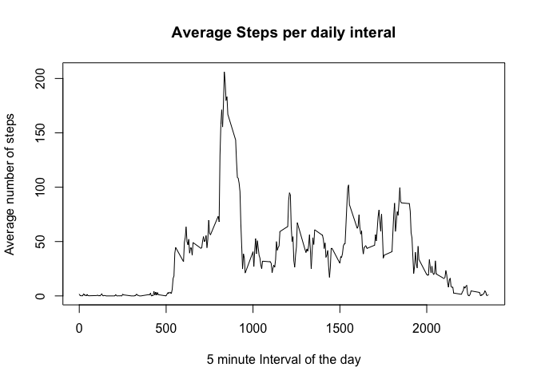
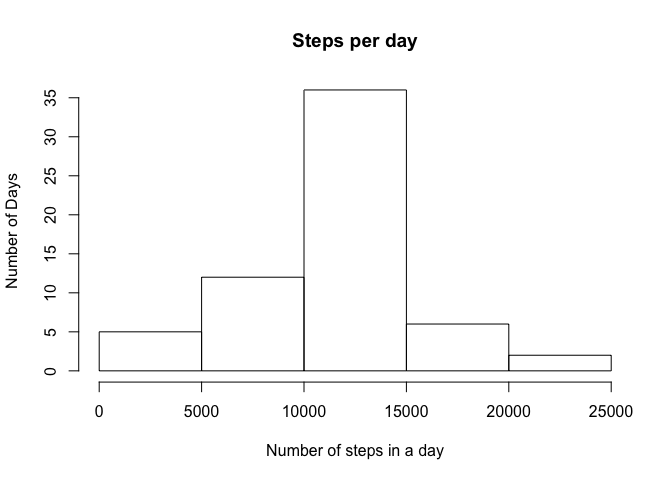
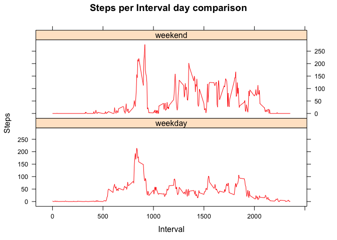

# Reproducible Research: Peer Assessment 1

```r
options(digits=2)
options(scipen=6)
```
## Loading and preprocessing the data

```r
unzip('activity.zip')
myData<-read.csv('activity.csv')
myData$interval <- sprintf("%04d", myData$interval)
```

## What is mean total number of steps taken per day?

```r
library(dplyr)
library(lubridate)
library(lattice)
```


```r
dayStep<-group_by(myData,date)
dayStep<-summarise(dayStep,steps=sum(steps))
hist(dayStep$steps,xlab='Number of steps in a day',ylab='Number of Days',main='Steps per day')
```

<!-- -->


```r
stepMean <- mean(dayStep$steps,na.rm=T)
stepMedian <- median(dayStep$steps,na.rm=T)
```


The mean steps per day is 10766.19 and the median steps per day is 10765.


## What is the average daily activity pattern?

```r
interSteps<-group_by(myData,interval)
interSteps<-summarise(interSteps,steps=mean(steps,na.rm = T))
plot(interSteps$interval,interSteps$steps,type='l',
     xlab='5 minute Interval of the day',
     ylab= 'Average number of steps',
     main='Average Steps per daily interal')
```

<!-- -->

## Imputing missing values


```r
NAcount<-sum(!complete.cases(myData))
```

There are 2304 rows with missing values as 'NA'


```r
myDataNoMiss<-myData
for (x in 1:nrow(myDataNoMiss)){
      if (is.na(myDataNoMiss[x,1])){
            myDataNoMiss[x,1]<-mean(myDataNoMiss$steps[myDataNoMiss$interval==myDataNoMiss[x,3]],na.rm = T)
      }
}

dayStepNoMiss<-group_by(myDataNoMiss,date)
dayStepNoMiss<-summarise(dayStepNoMiss,steps=sum(steps))
hist(dayStepNoMiss$steps,xlab='Number of steps in a day',ylab='Number of Days',main='Steps per day')
```

<!-- -->

```r
stepMeanNoMiss <- mean(dayStepNoMiss$steps,na.rm=T)
stepMedianNoMiss <- median(dayStepNoMiss$steps,na.rm=T)
```

The mean steps per day is 10766.19 and the median steps per day is 10765 with missing values.   
The mean steps per day is 10766.19 and the median steps per day is 10766.19 without missing values.

## Are there differences in activity patterns between weekdays and weekends?


```r
myData$DayOf<-as.factor(ifelse(as.POSIXlt(myData$date)$wday>=6,"weekend","weekday"))
interStepsWD<-group_by(myData,interval,DayOf)
interStepsWD<-summarise(interStepsWD,steps=mean(steps,na.rm = T))
interStepsWD$interval<-as.integer(interStepsWD$interval)
p<-xyplot(steps ~ interval | DayOf, data=interStepsWD,type='l',col='red')
p<-update(p,layout=c(1,2),main='Steps per Interval day comparison',ylab='Steps',xlab='Interval')
plot(p)
```

<!-- -->
